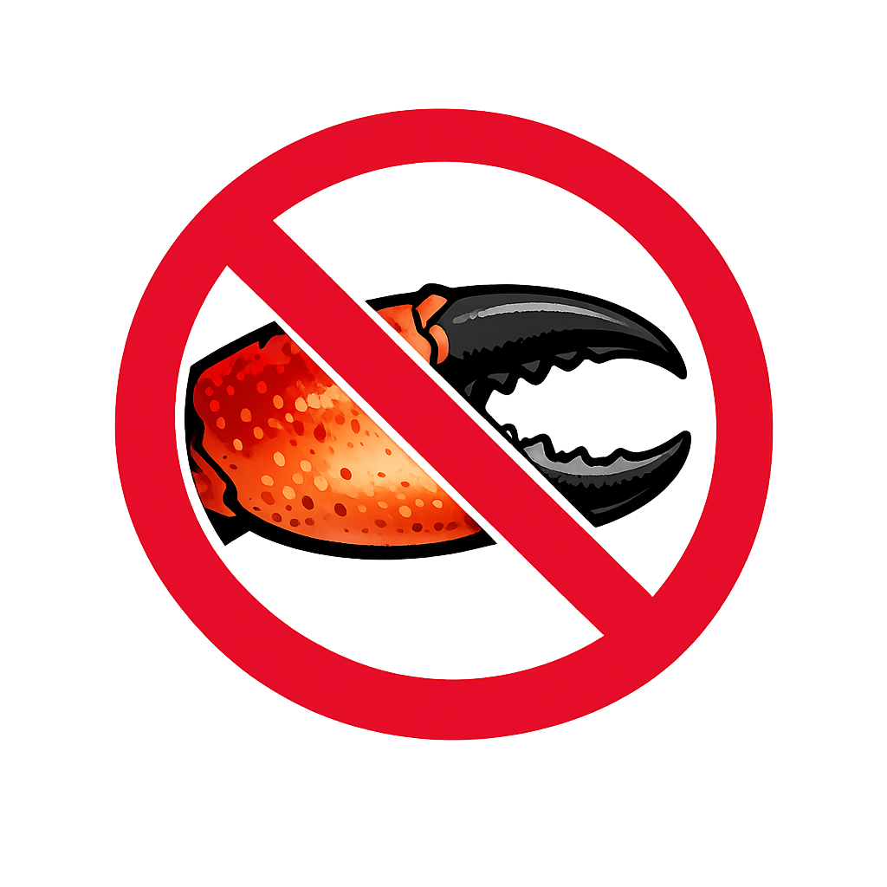

<p align="center">
  
</p>

# OpenDeclawed

Production-grade, security-hardened Docker deployment for OpenClaw, an AI agent platform. Fully parameterized with sensible defaults, kernel-level egress control, and multiple private ingress options.

## Features

- **Security-First Design**
  - Persistent egress firewall sidecar (iptables DOCKER-USER rules, survives Docker restarts)
  - DNS firewall (blocky) with threat blocklists — blocks malware C2, phishing, cryptomining
  - DNS-over-HTTPS upstream (Cloudflare + Quad9) — no plaintext DNS to ISP
  - Docker socket proxy for Watchtower — least-privilege API access, no raw socket
  - All containers: least-privileged user their function allows, cap_drop ALL, read-only rootfs where possible, isolated PID/IPC namespaces
  - Network isolation: internal network (no internet) + egress-controlled network
  - Skills allowlist with safe-install vetting pipeline (static analysis + VirusTotal + TOCTOU protection)

- **Fully Parameterized**
  - 40+ environment variables with sensible defaults
  - Secure credential collection (setup.sh with silent input, no screen echo)
  - CPU-only or GPU-accelerated deployment

- **Multiple Deployment Modes**
  - **Local** (default): Gateway on 127.0.0.1:18789, `allowInsecureAuth: false`
  - **Tunnel** (--profile tunnel): Cloudflare Tunnel + Access (GitHub OAuth), zero exposed ports, `allowInsecureAuth: true` (see [Auth Design](#control-ui-auth-design))
  - **Tailscale** (--profile tailscale): Tailscale mesh VPN, WireGuard-based, ACL-controlled
  - **Monitor** (--profile monitor): Watchtower auto-updates + Dozzle log viewer
  - **CLI** (--profile cli): Interactive shell for onboarding/debugging

- **Production-Ready**
  - Docker Compose v2.0+ with resource limits and reservations
  - Healthchecks with automatic restart (unless-stopped)
  - JSON file logging with rotation (10MB, 3 files)
  - Dozzle real-time log viewer (search, filter, regex across all containers)
  - Label-gated Watchtower auto-updates

## Architecture

```
┌─────────────────────────────────────────────────────────────────────┐
│                  CLOUDFLARE TUNNEL (Optional)                       │
│                 Profile: "tunnel" (opt-in)                          │
│                    cloudflared ←→ Tunnel                            │
└────────────────────────────┬────────────────────────────────────────┘
                             │
┌────────────────────────────▼────────────────────────────────────────┐
│                     openclaw-gateway                                │
│  (REST API, WebSocket, health checks)                              │
│  DNS: blocky (threat filtering + DoH)                              │
│  Networks: openclaw-internal + openclaw-egress                     │
└─────────┬──────────────────────────────────────┬────────────────────┘
          │                                      │
┌─────────▼──────────────────────────────────────▼────────────────────┐
│                     litellm (LLM router)                            │
│  OpenAI-compatible /v1 endpoint, internal-only network              │
│  Routes to: Ollama / MLX / vLLM / cloud APIs (external backends)   │
└────────────────────────────────────────────────────────────────────┘
                                           ┌─────────────┐
                                           │   blocky    │
                                           │(DNS firewall│
                                           │ DoH + block)│
                                           └─────────────┘

┌──────────────────────────────────────────────────────────────────────┐
│            EGRESS FIREWALL (Persistent Sidecar, 60s loop)           │
│  iptables DOCKER-USER: DROP RFC1918 | Survives Docker restarts     │
└──────────────────────────────────────────────────────────────────────┘

┌─ MONITORING (always-on) ────────────────────────────────────────────┐
│  dozzle → real-time log viewer       watchtower → socket-proxy     │
│  (127.0.0.1:5005)                    (no raw docker.sock access)   │
└─────────────────────────────────────────────────────────────────────┘
```

## Quick Start

### 1. Prerequisites

- Docker Engine 20.10+ with Compose v2.0+
- 8GB+ RAM (CPU-only) or 16GB+ (GPU)
- Linux kernel with iptables support (DOCKER-USER chain)

**See [`docs/prerequisites.md`](docs/prerequisites.md) for the full guide**: how to get every API key (Anthropic, VirusTotal, Cloudflare, Tailscale, Telegram), download models, and store secrets securely.

### 2. Local Mode (No Cloudflare)

```bash
# Clone repo
git clone https://github.com/yourusername/opendeclawed.git
cd opendeclawed

# Copy environment template and customize
cp .env.example .env
# Edit .env with your model filenames, resource limits, etc.

# Start containers (local mode)
docker-compose up -d

# Check status
docker-compose ps
docker-compose logs openclaw-gateway

# Test API
curl http://127.0.0.1:18789/health
```

### 3. Tunnel Mode (Cloudflare)

```bash
# Setup Cloudflare tunnel
# 1. Go to https://dash.cloudflare.com/ → Tunnels → Create tunnel
# 2. Name: "openclaw"
# 3. Copy tunnel token

# Set token in .env
echo "CLOUDFLARE_TOKEN=eyJhIjoiXXXXXX..." >> .env

# Start with tunnel profile
docker-compose --profile tunnel up -d

# Verify tunnel is connected
docker-compose logs cloudflared | tail -20
```

### 4. CLI Mode (Onboarding)

```bash
# Interactive shell for onboarding/debugging
docker-compose --profile cli run openclaw-cli bash

# Inside container:
openclaw agent list
openclaw playground
openclaw config show
```

## Configuration

### Environment Variables

See `.env.example` for comprehensive documentation. Key variables:

**Images**
- `OPENCLAW_IMAGE`: Gateway and CLI image
- `CLOUDFLARED_IMAGE`: Cloudflare tunnel image
- `ALPINE_IMAGE`: Base image for egress firewall sidecar

**Resources**
- `GATEWAY_MEM`: Memory limit
- `GATEWAY_CPUS`: CPU limit
- Reservation variants for QoS guarantees

**LiteLLM (LLM Router)**
- `LITELLM_IMAGE`: LiteLLM proxy image
- `LITELLM_PORT`: LiteLLM API port (default: 4000, internal only)
- `LITELLM_MASTER_KEY`: Internal API key for gateway-to-LiteLLM auth
- `LITELLM_CONFIG`: Path to LiteLLM config file (default: ./litellm_config.yaml)
- `LITELLM_CPUS`, `LITELLM_MEM`: Resource limits

**Network**
- `GATEWAY_PORT`: REST API port (default: 18789)
- `INTERNAL_SUBNET`: LiteLLM + gateway network (default: 172.27.0.0/24)
- `EGRESS_SUBNET`: egress-controlled network (default: 172.28.0.0/24)

**Cloudflare Tunnel (optional)**
- `CLOUDFLARE_TOKEN`: Tunnel authentication token
- `CLOUDFLARE_TUNNEL_NAME`: Tunnel name (for logging)
- `CLOUDFLARE_TUNNEL_ROUTE`: Public hostname (for reference)

### Resource Sizing

**Minimal (4GB RAM)**
```env
GATEWAY_MEM=2g
GATEWAY_CPUS=2
LITELLM_MEM=512m
LITELLM_CPUS=1
```

**Standard (8GB+ RAM)**
```env
GATEWAY_MEM=4g
GATEWAY_CPUS=4
LITELLM_MEM=1g
LITELLM_CPUS=2
```

## Security Details

### Egress Firewall

The `egress-firewall` service installs kernel-level iptables rules in the DOCKER-USER chain on startup. This prevents containers from reaching:

- RFC1918 private ranges (10.0.0.0/8, 192.168.0.0/16, 172.16.0.0/12)
- Link-local (169.254.0.0/16)
- Multicast (224.0.0.0/4)
- Reserved (240.0.0.0/4)
- Host gateway IP (172.17.0.1)

Allowed traffic:
- Established/related connections (stateful)
- DNS queries (:53)
- Inter-container traffic (openclaw-egress network)
- Docker bridge traffic (172.17.0.0/16)

### Network Isolation

**openclaw-internal** (bridge, internal=true):
- litellm, openclaw-gateway, blocky, docker-socket-proxy, watchtower, dozzle, cloudflared, tailscale, openclaw-cli
- No internet access (internal: true)
- Services communicate on private network only

**openclaw-egress** (bridge):
- openclaw-gateway, blocky, cloudflared, tailscale, dozzle, openclaw-cli
- Subject to egress firewall rules
- Allows outbound to external APIs (with restrictions)

### Container Hardening

Services run as the least-privileged user their function allows:
- **65534:65534** (nobody:nogroup): litellm, cloudflared, blocky, dozzle
- **1000:1000** (node): openclaw-gateway, openclaw-cli (upstream image requirement)
- **root**: egress-firewall (iptables), docker-socket-proxy (socket binding), watchtower (Docker API), tailscale (WireGuard)

All services:
- Capabilities: drop ALL, then selectively add only what is needed
- Read-only filesystem where possible (exceptions: egress-firewall, docker-socket-proxy, gateway, cli)
- no_new_privileges: true (cannot escalate privileges)
- ipc: private (isolated inter-process communication)

### Healthchecks

**openclaw-gateway**:
```
curl -sf http://127.0.0.1:18789/health
interval: 10s, timeout: 5s, retries: 5, start_period: 30s
```

Cloudflared depends on this healthcheck (service_healthy) before starting.

## Control UI Auth Design

The OpenClaw Control UI supports a `allowInsecureAuth` flag that permits code-based device pairing over HTTP (without TLS). The setup script sets this dynamically based on ingress mode:

| Ingress Mode | `allowInsecureAuth` | Rationale |
|---|---|---|
| **tunnel** | `true` | Safe. The only route to the Control UI is through a Cloudflare Tunnel protected by Cloudflare Access + GitHub OAuth. All traffic is encrypted (HTTPS) between the user and Cloudflare edge, and between Cloudflare and the tunnel connector. The gateway token is still required for pairing. Enabling this allows code-only device pairing without requiring the gateway to terminate TLS itself. |
| **local** | `false` | The gateway listens on `127.0.0.1` only, but HTTP traffic is unencrypted. Code-based pairing over plaintext HTTP could expose the pairing code to local process snooping. |
| **tailscale** | `false` | Tailscale provides WireGuard encryption, but `allowInsecureAuth` is kept off as a defense-in-depth measure since Tailscale serves traffic directly without an additional authentication gate. |

To override this default, edit the `allowInsecureAuth` value in `~/.openclaw/openclaw.json` after running setup.

### Additional Hardening

The generated config also applies these OpenClaw security best practices:

- **mDNS discovery disabled** (`discovery.mdns.mode: "off"`): The gateway runs inside Docker with no local network peers to discover it. Disabling mDNS prevents leaking operational details (filesystem paths, SSH ports) via Bonjour broadcasts.
- **Token auth required** (`auth.mode: "token"`): All WebSocket connections require the gateway token. The gateway refuses connections without credentials (fail-closed).
- **Trusted proxies configured**: Docker network subnets are listed in `trustedProxies` so the gateway correctly identifies client IPs from `X-Forwarded-For` headers when behind the Cloudflare tunnel or Tailscale proxy.

Run `openclaw security audit --deep` after deployment to verify the configuration.

## Troubleshooting

### Containers crash on startup

**Check logs:**
```bash
docker-compose logs openclaw-gateway
docker-compose logs litellm
```

**Common issues:**
- Out of memory: Increase `GATEWAY_MEM` in .env
- Port conflicts: Change `GATEWAY_PORT`

### Egress firewall blocks legitimate traffic

The firewall is intentionally strict. To debug:

```bash
# Check DOCKER-USER rules
docker exec opendeclawed-egress-firewall iptables -L DOCKER-USER -vn
docker exec opendeclawed-egress-firewall ip6tables -L DOCKER-USER -vn

# To modify rules, edit docker-compose.yml egress-firewall entrypoint:
# 1. Restart containers to apply changes:
docker-compose down
docker-compose up -d
```

### API not responding

```bash
# Check gateway health
curl http://127.0.0.1:18789/health

# Check if gateway is on both networks
docker network inspect openclaw-internal
docker network inspect openclaw-egress
```

### Cloudflare tunnel not connecting

```bash
# Check tunnel logs
docker-compose logs cloudflared

# Verify token is set
echo $CLOUDFLARE_TOKEN

# Check gateway is healthy (tunnel depends on this)
docker-compose ps
curl http://127.0.0.1:18789/health
```

## Advanced Usage

### Custom Egress Rules

Edit the `egress-firewall` service's `entrypoint` in `docker-compose.yml` to:
- Allow specific external IPs/ranges
- Add protocol-specific rules
- Monitor traffic with logging

```bash
# Example: Allow external API calls to api.example.com
iptables -I DOCKER-USER 1 -d api.example.com -j ACCEPT
```

Then restart:
```bash
docker-compose down && docker-compose up -d
```

### Monitoring

```bash
# Real-time resource usage
docker stats opendeclawed-gateway opendeclawed-litellm

# Logs with follow
docker-compose logs -f openclaw-gateway

# Check resource limits
docker inspect opendeclawed-gateway | grep -A 20 "HostConfig"
```

### Backup and Restore

```bash
# Backup gateway config directory (bind-mounted from host)
tar czf openclaw-backup.tar.gz -C ~/.openclaw .

# Restore
mkdir -p ~/.openclaw
tar xzf openclaw-backup.tar.gz -C ~/.openclaw
chmod 700 ~/.openclaw
chmod 600 ~/.openclaw/openclaw.json
```

## Contributing

Contributions welcome! Please:
1. Test security changes with egress firewall (iptables)
2. Verify all env vars have sensible defaults
3. Update .env.example for new parameters
4. Keep docker-compose.yml comments current

## License

MIT License. See [LICENSE](LICENSE) for details.

## Security Reporting

For security issues, email security@example.com or use GitHub security advisory.
Do NOT open public issues for security vulnerabilities.

## References

- OpenClaw: https://github.com/openagentsinc/openclaw
- Docker Compose: https://docs.docker.com/compose/
- Cloudflare Tunnels: https://developers.cloudflare.com/cloudflare-one/connections/connect-networks/
- Linux Capabilities: https://man7.org/linux/man-pages/man7/capabilities.7.html
- iptables: https://linux.die.net/man/8/iptables
